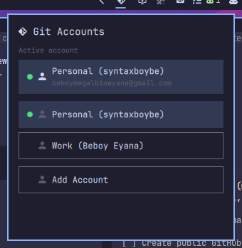

# Git Switcher

View and switch between Git identities from the Omarchy bar. One icon — click
it, pick the account, and the global `user.name` / `user.email` update
instantly.

## Screenshot



## Requirements

- [`git`](https://git-scm.com/) on `PATH`.

## Install

```sh
omarchy plugin add https://github.com/syntaxboybe/omarchy-git-switcher.git --enable
```

## Usage

- **Left click** the git icon to open the account list.
- **Click an account** to set it as the global Git identity
  (`git config --global user.name` / `user.email`).
- The active account is marked with a green dot.
- **Right click** the icon to refresh.

## Configure accounts

Accounts live in `~/.config/omarchy/git-switcher.json`:

```json
{
  "accounts": [
    { "label": "Personal", "name": "syntaxboybe", "email": "you@example.com" },
    { "label": "Work",     "name": "Jane Doe",     "email": "jane@company.com" }
  ]
}
```

- `label` — friendly name shown in the popup.
- `name` — the git `user.name`.
- `email` — the git `user.email`.

The file is re-read every time the panel opens, so edits apply immediately.
You can also open it from the popup via the **Add Account** button.

## Remove

```sh
omarchy plugin remove syntaxboybe.git-switcher
```

## License

[MIT](LICENSE)
